Hướng dẫn chạy bài
    git clone [link]
    npm install
    npm start
React Demo: ES6, JSX & Fragments
1. ES6 (ECMAScript 2015)
Const Variables - Biến Hằng

    const: Khai báo biến không thể gán lại giá trị
    Dùng cho dữ liệu không thay đổi trong suốt vòng đời component
Template Literals - Chuỗi Mẫu
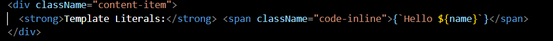
    Backticks (`) cho phép nhúng biến với ${}
    Kết quả: Hello John
    Ngắn gọn hơn "Hello " + name
Destructuring - Phân Rã
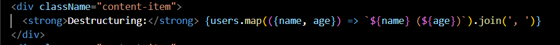
    Lấy trực tiếp thuộc tính từ object: {name, age}
    Kết quả: Alice (25), Bob (30)
Spread Operator - Toán Tử Trải Rộng
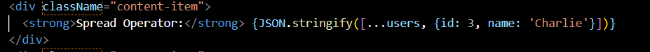
    Sao chép mảng cũ và thêm phần tử mới
    Kết quả: Mảng có 3 user
Arrow Functions - Hàm Mũi Tên
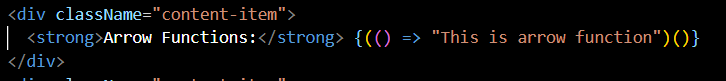
    Cú pháp ngắn gọn, không có function keyword
    Tự động bind this
Default Parameters - Tham Số Mặc Định
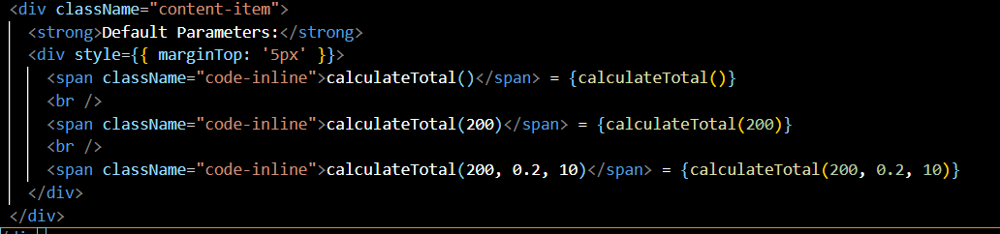
    Giá trị mặc định khi không truyền tham số
    Ví dụ: calculateTotal() → 110 (dùng giá trị mặc định)

 2. JSX (JavaScript XML)
 JavaScript trong JSX
 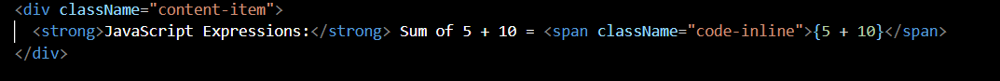
    {} cho phép nhúng bất kỳ biểu thức JavaScript nào
    Tính toán trực tiếp trong JSX
Event Handlers - Xử Lý Sự Kiện
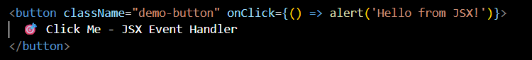
    Gắn hàm trực tiếp vào thuộc tính sự kiện
    Viết camelCase: onClick, onChange, onSubmit
Conditional Rendering - Render Có Điều Kiện
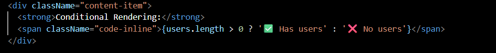
    Toán tử ternary ? : cho if-else ngắn gọn
    Logic: Nếu có user → hiển thị ✅, ngược lại → ❌
Inline Styles - Style Trực Tiếp
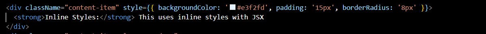
    Style là JavaScript object với camelCase
    Outer {} cho JS, inner {} cho object CSS
className Thay Vì class
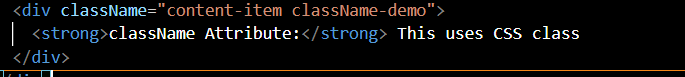
    Dùng className trong JSX (tránh từ khóa class của JS)
    Áp dụng CSS từ file .css

3. React Fragments - TRỌNG TÂM DEMO NÀY

Demo 1: Fragment Trong Table
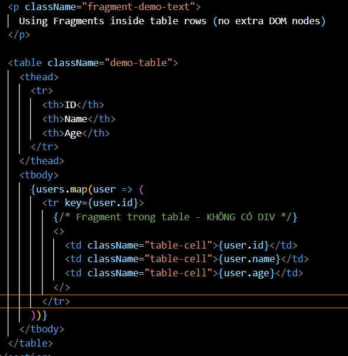
Tại sao cần Fragment trong table?
    HTML cấm 
 trong <tr>
    Fragment nhóm các <td> mà không thêm node
    DOM sạch: chỉ có <tr><td>...</td></tr>
Demo 2: Fragment Với Key
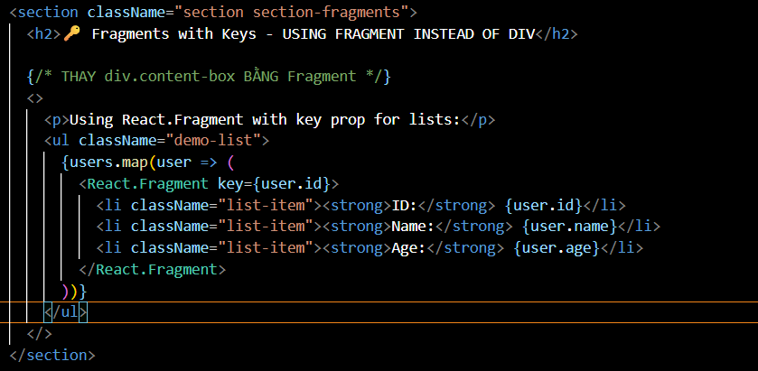
Khi nào dùng <React.Fragment> thay vì <>?
    Khi cần thuộc tính như key trong list
    key giúp React tối ưu việc cập nhật list
