# CAB Booking System - Week 1
## React & Python Concurrency Demo

### 👥 Team Members
1. Nguyễn Minh Anh - PO/BA
2. Nguyễn Võ Ngọc My - Scrum Master
3. Nguyễn Hoàng Khang - SSAD
4. Ân Hiền Bảo Phúc - AI Engineer
5. Hồ Quốc Huy - DevOps Engineer
6. Trương Vỹ Hào - Cloud Engineer
7. Lê Thị Thanh Thảo - UI/UX Designer
8. Cao Thành Đông - SQA/Tester
9. Nguyễn Mai Đình - Cyber Security
10. Lê Thị Hiền - Software Engineer

# 4. Visual Studio Code Demo
Vô terminal của VS studio code clone project về bằng các lệnh trong hình dưới đây
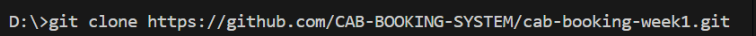

---

## 4.1. Demo xây dựng Backend NodeJS sử dụng Express Framework

### Bước 1: Cài đặt Express Generator

Mở Terminal trong Visual Studio Code và cài đặt Express Generator.
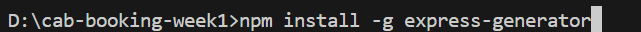

### Bước 2: Tiến hành express 10 thư mục tương ứng với 10 service có trong dự án
Ví dụ: express auth-service
Kết quả  
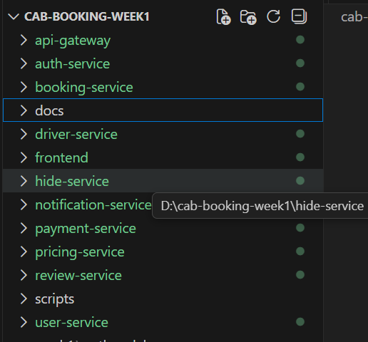
### Bước 3: Xóa tất cả các file trong routes và views, xóa nội dung của file app.js
### Bước 4: Vào từng service gõ câu lệnh npm install
### Bước 5: Trong mỗi service chúng ta làm như sau:
+ Tạo file môi trường env

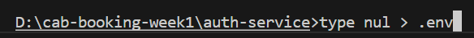

+ Cài đặt package dotenv để NodeJS có thể đọc biến môi trường từ file .env
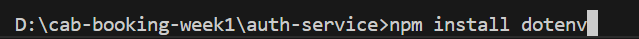
+ Tạo thư mục src
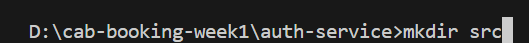
 
+ mv routes src/: di chuyển thư mục routes vào trong src
+ mv app.js src/: di chuyển file app.js vào trong src
+ Trong thư mục src bắt đầu tạo các thư mục như hình bên dưới

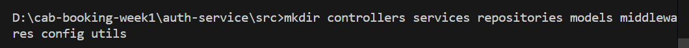

### Bước 6: Tiến hành code theo thứ tự: env → config → models → repositories → services → middlewares → controllers → routes → app.js
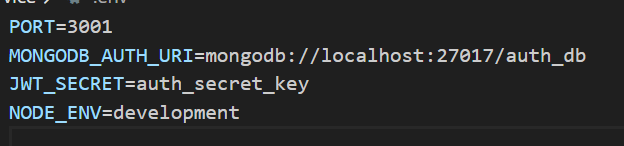
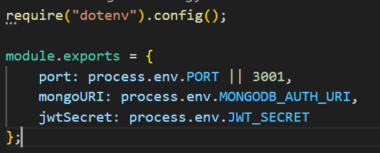
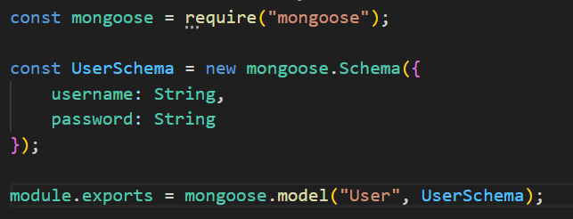
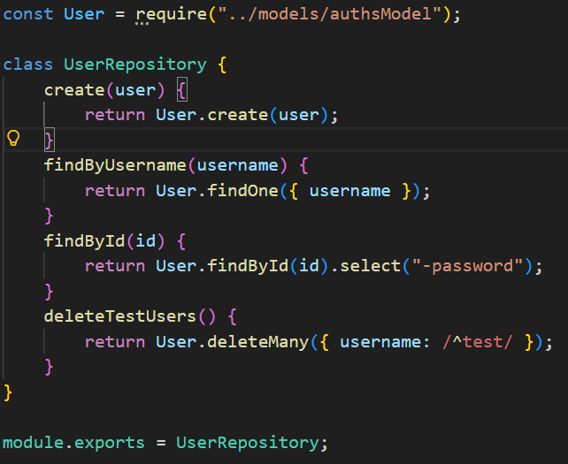
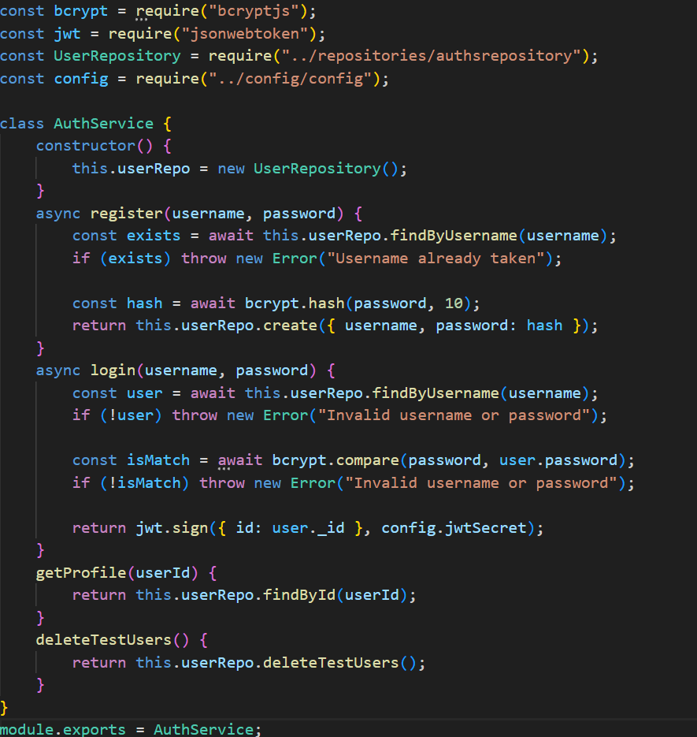
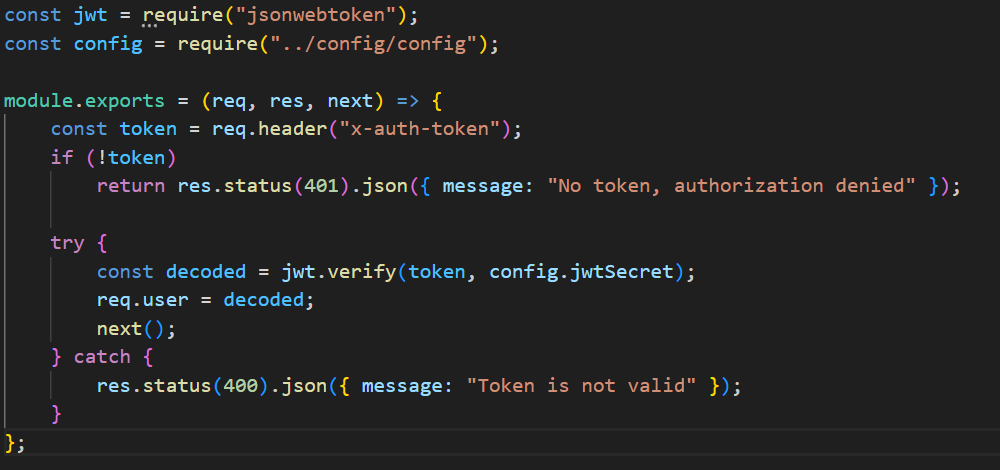
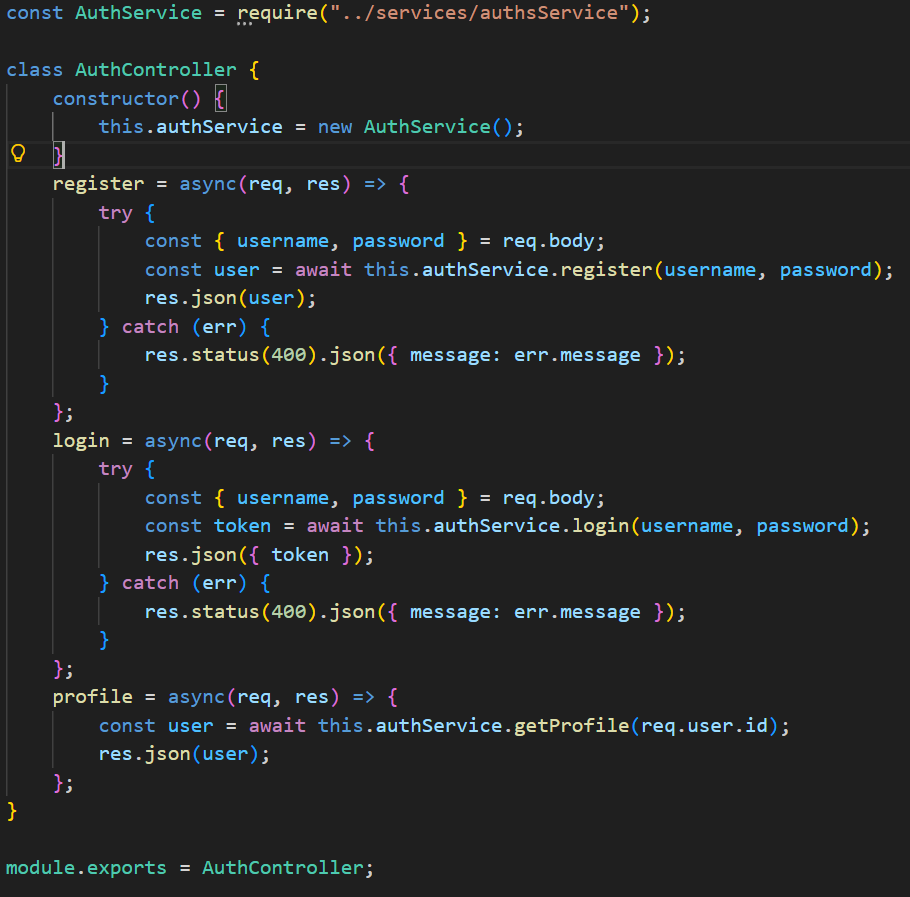
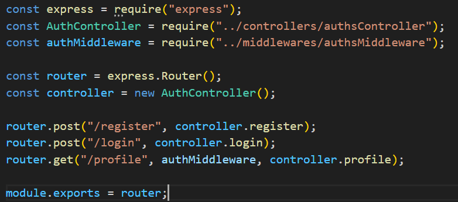
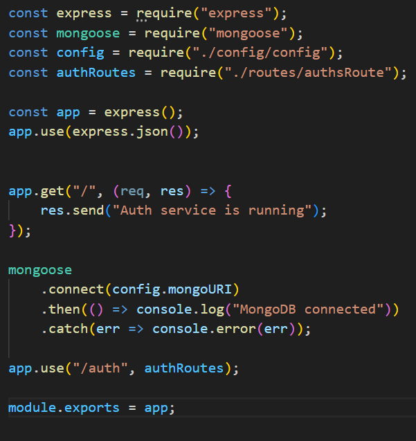

### Bước 7: Chạy ứng dụng
### Kết quả:
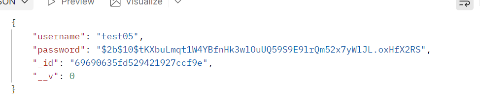

+ Kết quả khi đăng nhập
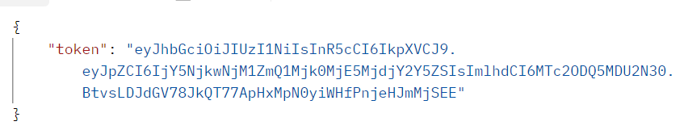

---

## 4.2. Demo React
### Bước 1: Mở terminal, gõ lệnh
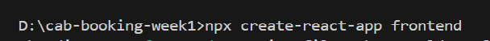

### Bước 2: cd vào thư mục frontend
### Bước 3: Cài các thư viện cần thiết
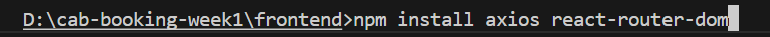
 
### Bước 4: Chạy ứng dụng
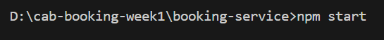

### Kết quả
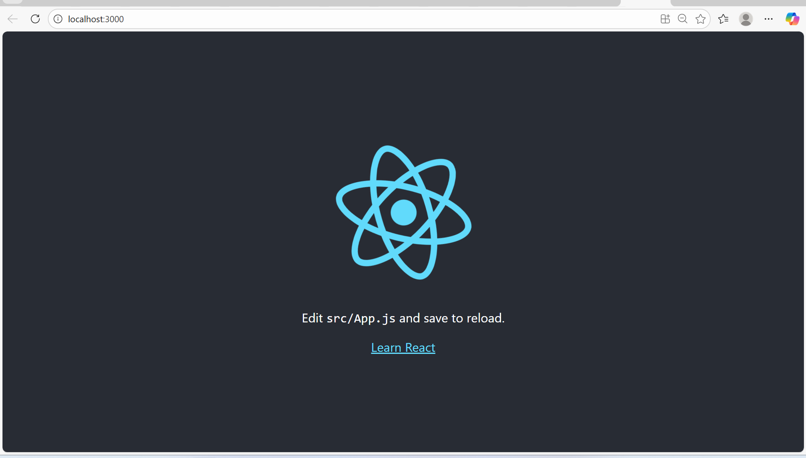

# 5. Node JS overview
## 5.1. NodeJS là gì?
+ Môi trường chạy JavaScript phía server (backend)
+ Cho phép viết ứng dụng JavaScript ở cả client và server
+ Dựa trên Google V8 Engine (cùng bộ máy với trình duyệt Chrome)
+ Chỉ chạy trên 1 luồng (single – thread), nhưng có thể xử lý hàng nghìn request cùng lúc nhờ Event - Loop
+ NodeJS sử dụng mô hình Non-blocking I/O (không chặn luồng), kết hợp với kiến trúc Event-driven và Asynchronous (bất đồng bộ), giúp tối ưu hiệu suất xử lý.

---

## 5.2. Ưu điểm của NodeJS
+ Xử lý nhiều request cùng lúc
+ Hiệu suất cao, ít tốn tài nguyên
+ Phù hợp cho ứng dụng real – time (chat, game, streaming)
+ Dễ mở rộng và phát triển theo kiến trúc Microservices
+ Sử dụng cùng một ngôn ngữ (JavaScript) cho toàn hệ thống
+ Sở hữu hệ sinh thái thư viện lớn với npm – Node Package Manager

---

## 5.3. Ứng dụng thực tế
+ Chat real – time: Messenger, Zalo Web
+ API Server: RESTful API cho web hoặc mobile
+ Streaming: Video, nhạc, game online

---

# 6. Chrome DevTools
## 6.1. Chrome DevTools là gì?
Chrome DevTools là bộ công cụ dành cho lập trình viên được tích hợp sẵn trong trình duyệt Google Chrome, dùng để kiểm tra, phân tích và debug ứng dụng web. Công cụ này hỗ trợ:
+ Theo dõi và phát hiện lỗi JavaScript
+ Kiểm tra cấu trúc giao diện HTML/CSS
+ Giám sát các request API
+ Phân tích dữ liệu trao đổi giữa frontend và backend
+ Kiểm tra dữ liệu API trả về từ server

---

## 6.2. Các bước sử dụng Chrome DevTools
### Bước 1: Mở Google Chrome

### Bước 2: Nhấn Ctrl + Shift + I
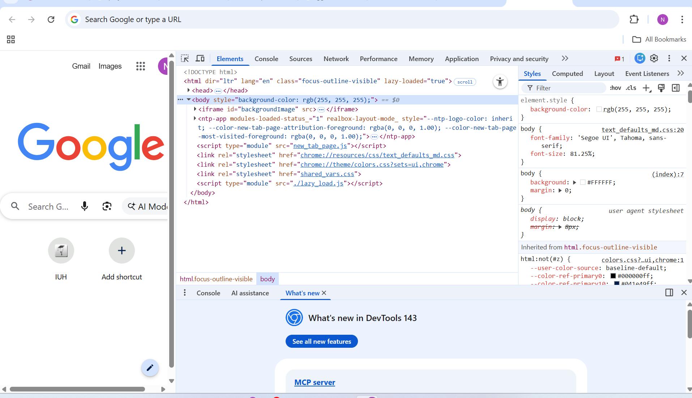

### Bước 3: Kiểm tra giao diện bằng tab Elements
+ Chọn tab Elements
+ Xem cấu trúc HTML của trang
+ Chỉnh sửa trực tiếp CSS để kiểm tra giao diện ngay lập tức

### Bước 4: Kiểm tra lỗi JavaScript bằng tab Console
+ Chọn tab Console
+ Xem các thông báo lỗi của chương trình
+ Chạy thử các đoạn lệnh JavaScript trực tiếp

### Bước 5: Theo dõi API bằng tab Network
+ Chọn tab Network
+ Refresh lại trang (F5)
+ Kiểm tra các request gửi từ frontend lên backend
+ Xem dữ liệu API trả về (Response)

### Bước 6: Kiểm tra hiệu năng bằng tab Performance
+ Dùng để đo tốc độ tải trang
+ Xác định các thành phần làm chậm ứng dụng

### Bước 7: Debug JavaScript bằng tab Sources
+ Đặt breakpoint
+ Theo dõi luồng thực thi của chương trình
+ Kiểm tra giá trị biến trong lúc chạy

### 🚀 Quick Start
```bash
git clone https://github.com/[username]/cab-booking-iuh-week1.git
cd cab-booking-iuh-week1/week1/react-demo
npm install
npm start